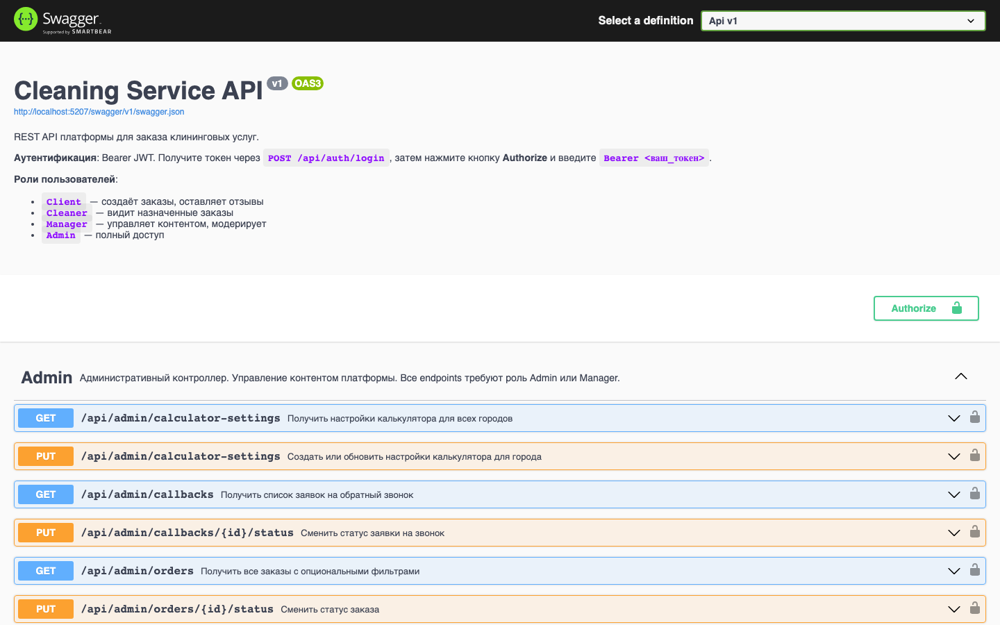
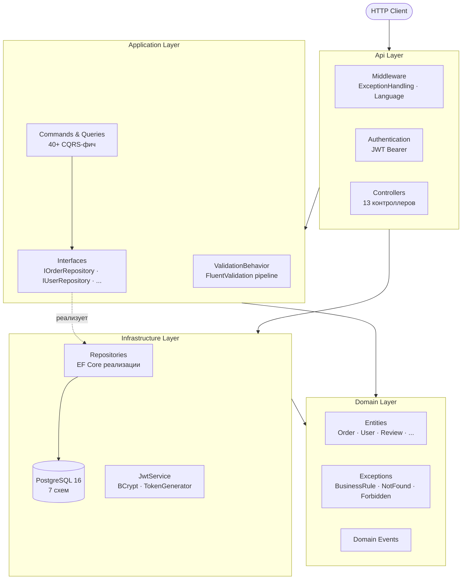

# Cleaning Service Platform

> Backend-платформа для онлайн-заказа клининговых услуг, построенная по принципам **Clean Architecture**, **DDD** и **CQRS**. Реальный production-ready проект, демонстрирующий enterprise-подход к разработке на .NET 9.



---

## О проекте

Платформа автоматизирует полный цикл клинингового бизнеса: клиент выбирает услугу и рассчитывает стоимость прямо на сайте, менеджер назначает уборщика, уборщик фиксирует выполнение. Администратор модерирует контент и видит аналитику.

**Почему этот проект интересен технически:**

- Это не учебный TODO-лист. Здесь настоящие бизнес-правила: жизненный цикл заказа, ролевая модель из 4 ролей, snapshot цен при создании заказа, очередь модерации отзывов
- Архитектура сознательно выбрана под масштабирование: 7 Bounded Contexts, изолированных через ID, готовы стать микросервисами
- Каждое решение задокументировано и обосновано — не "так принято", а "потому что"

---

## Технологический стек

| Категория | Технология | Версия |
|-----------|-----------|--------|
| Runtime | .NET / C# | 9.0 / 13 |
| Архитектура | Clean Architecture + DDD + CQRS | — |
| Медиатор | MediatR | 12.x |
| ORM | Entity Framework Core | 9.0 |
| База данных | PostgreSQL | 16 |
| Аутентификация | JWT Bearer + Refresh Tokens | — |
| Хеширование | BCrypt.Net | — |
| Валидация | FluentValidation | 11.x |
| Документация API | Swagger / OpenAPI (Swashbuckle) | — |
| Контейнеризация | Docker + Docker Compose | — |
| Тесты | xUnit + интеграционные | — |

---

## Архитектура

Проект строго следует **Clean Architecture** — зависимости направлены только внутрь:

```
┌─────────────────────────────────────────┐
│                   Api                   │  ← HTTP, Controllers, Middleware
│  ┌───────────────────────────────────┐  │
│  │           Application             │  │  ← CQRS, Handlers, Validators, DTOs
│  │  ┌─────────────────────────────┐  │  │
│  │  │          Domain             │  │  │  ← Entities, Business Rules, Exceptions
│  │  └─────────────────────────────┘  │  │
│  └───────────────────────────────────┘  │
│           Infrastructure                │  ← EF Core, Repositories, JWT, BCrypt
└─────────────────────────────────────────┘
```



**Ключевые принципы, реализованные в коде:**

- **Domain не зависит ни от чего** — Entity Framework, HTTP, MediatR — всё это инфраструктура, Domain о ней не знает
- **Бизнес-правила только в Domain** — `Order.Cancel()` сам знает, когда отмена допустима; Application-слой только вызывает
- **Все свойства `private set`** — состояние Entity меняется только через явные методы с именами, отражающими намерение
- **Контексты общаются через ID** — `Review.OrderId` — это `int?`, не навигационное свойство; нет риска случайно загрузить чужой контекст

### CQRS через MediatR

Каждая операция — отдельный класс в `src/Application/Features/{Context}/{Feature}/`:

```
CreateOrder/
├── CreateOrderCommand.cs      ← что делаем и с какими данными
├── CreateOrderHandler.cs      ← как делаем
└── CreateOrderValidator.cs    ← FluentValidation — запускается автоматически через pipeline
```

`ValidationBehavior<TRequest, TResponse>` подключён в MediatR pipeline — валидация происходит **до** вызова любого Handler, автоматически, без дублирования кода в контроллерах.

### Pipeline обработки запроса

```
HTTP Request
    ↓
ExceptionHandlingMiddleware   ← перехватывает ВСЕ исключения, форматирует ответ
    ↓
LanguageMiddleware            ← определяет язык из ?lang= или Accept-Language
    ↓
Authentication / Authorization ← JWT валидация, проверка политик
    ↓
Controller                    ← только HTTP: парсинг запроса, вызов MediatR
    ↓
ValidationBehavior            ← FluentValidation по всем правилам
    ↓
Handler                       ← бизнес-сценарий, оркестрация
    ↓
Domain Entity                 ← бизнес-правила, исключения
    ↓
Repository → EF Core → PostgreSQL
```

---

## Domain Model

### Bounded Contexts

Платформа разбита на **7 изолированных контекстов**, каждый в своей схеме PostgreSQL:

| Контекст | Тип | Сущности | Описание |
|----------|-----|----------|----------|
| **Identity** | Generic | `User`, `RefreshToken` | Пользователи, роли, токены |
| **Orders** | **Core Domain** | `Order`, `OrderService`, `OrderExtraService`, `OrderStatusHistory` | Центральный контекст |
| **Catalog** | Supporting | `Service`, `ExtraService`, `Category`, `City`, `TimeSlot`, `CalculatorSettings` | Каталог услуг |
| **Content** | Supporting | `Review`, `FAQ`, `CallBackRequest`, `Page` | Публичный контент |
| **Admin** | Generic | Агрегация данных | Аналитика, управление |
| **Payment** | Supporting | `Payment` | Оплата (в разработке) |
| **Notifications** | Supporting | — | Email по событиям (в разработке) |

### Жизненный цикл заказа

```
         Client создаёт
              ↓
           [ New ]
              ↓  Manager назначает уборщика
          [ Assigned ]
              ↓  Cleaner начинает работу
          [ InProgress ]
              ↓  Cleaner завершает
          [ Completed ]

     [ New ] или [ Assigned ]
              ↓  Client / Manager отменяет
          [ Cancelled ]
```

Переходы инкапсулированы в методах `Order`: `AssignCleaner()`, `StartWork()`, `Complete()`, `Cancel()`. Нарушение допустимого перехода → `BusinessRuleException` → `409 Conflict`.

### Расчёт цены заказа (Snapshot-паттерн)

При создании заказа цены **загружаются из БД на сервере** и фиксируются в заказе:

```
TotalPrice = max(
    areaPrice       (площадь × PricePerSqm из CalculatorSettings),
    bathroomsPrice  (санузлы × PricePerBathroom),
    servicePrice    (сумма BasePrice выбранных услуг),
    extraPrice      (сумма цен доп. услуг),
    MinimumOrderAmount
)
```

Клиент **не может подменить цену в запросе** — в `CreateOrderRequest` нет ценовых полей. Даже если завтра цена услуги изменится — исторические заказы сохраняют исходную стоимость.

---

## Обработка ошибок

Единый `ExceptionHandlingMiddleware` преобразует доменные исключения в HTTP-ответы:

| Исключение | HTTP | Когда |
|-----------|------|-------|
| `NotFoundException` | 404 | Сущность не найдена по ID |
| `BusinessRuleException` | 409 | Нарушение бизнес-правила (неверный переход статуса, повторная модерация) |
| `ForbiddenException` | 403 | Нет прав на операцию |
| `ValidationException` | 400 | Ошибки FluentValidation с детализацией по полям |
| `UnauthorizedAccessException` | 401 | Не определён пользователь из JWT |

Ответ всегда имеет одну структуру:

```json
{
  "statusCode": 400,
  "error": "ValidationError",
  "message": "Ошибка валидации.",
  "validationErrors": {
    "area": ["Площадь должна быть больше нуля."],
    "services": ["Необходимо выбрать хотя бы одну услугу."]
  },
  "traceId": "0HMVFE0PA3CKP:00000001"
}
```

В `Production` стек-трейс не возвращается — только `traceId` для поиска в логах.

---

## Безопасность

- **JWT** (HS256) + **Refresh Token** с ротацией: при обновлении старый токен отзывается, выдаётся новый
- **BCrypt** для хеширования паролей (cost factor 12)
- **Именованные политики** авторизации вместо строковых ролей:

```csharp
// src/Api/Authorization/Policies.cs
public static class Policies
{
    public const string AdminOnly      = "AdminOnly";
    public const string AdminOrManager = "AdminOrManager";
    public const string CleanerOnly    = "CleanerOnly";
    public const string Staff          = "Staff";  // Admin + Manager + Cleaner
}

// В контроллере:
[Authorize(Policy = Policies.AdminOrManager)]
```

- **Роли** задаются в JWT claim, проверяются до вызова бизнес-логики
- Переменные среды для секретов — `Jwt__Key`, пароль БД — никогда не в коде

---

## API

Полная интерактивная документация: **`/swagger`** (доступна в Development)

### Endpoints по группам

<details>
<summary><strong>Аутентификация</strong></summary>

| Метод | URL | Доступ | Описание |
|-------|-----|--------|----------|
| POST | `/api/auth/register` | Публичный | Регистрация, роль Client |
| POST | `/api/auth/login` | Публичный | Вход, получение JWT + Refresh |
| POST | `/api/auth/refresh` | Публичный | Обновление access token |
| POST | `/api/auth/logout` | Authorized | Отзыв всех refresh токенов |

</details>

<details>
<summary><strong>Заказы</strong></summary>

| Метод | URL | Доступ | Описание |
|-------|-----|--------|----------|
| POST | `/api/orders` | Client | Создать заказ (цены рассчитываются на сервере) |
| GET | `/api/orders` | Client | Список своих заказов |
| GET | `/api/orders/{id}` | Client (владелец) | Детали заказа с разбивкой цены |
| GET | `/api/orders/admin` | Manager, Admin | Все заказы |
| PUT | `/api/orders/admin/{id}/status` | Manager, Admin | Изменить статус заказа |

</details>

<details>
<summary><strong>Каталог и калькулятор</strong></summary>

| Метод | URL | Доступ | Описание |
|-------|-----|--------|----------|
| POST | `/api/calculator` | Публичный | Расчёт стоимости уборки |
| GET | `/api/services` | Публичный | Список услуг |
| GET | `/api/categories` | Публичный | Категории услуг |
| GET | `/api/extra-services` | Публичный | Доп. услуги |
| CRUD | `/api/extra-services` | Admin | Управление доп. услугами |

</details>

<details>
<summary><strong>Контент и модерация</strong></summary>

| Метод | URL | Доступ | Описание |
|-------|-----|--------|----------|
| GET | `/api/reviews` | Публичный | Только одобренные отзывы |
| POST | `/api/reviews` | Authorized | Оставить отзыв (статус Pending) |
| GET | `/api/faq` | Публичный | Активные FAQ |
| POST | `/api/callbacks` | Публичный | Заявка на обратный звонок |

</details>

<details>
<summary><strong>Администрирование</strong></summary>

| Метод | URL | Доступ | Описание |
|-------|-----|--------|----------|
| GET | `/api/admin/reviews` | Admin, Manager | Все отзывы |
| GET | `/api/admin/reviews/pending` | Admin, Manager | Очередь на модерацию |
| PUT | `/api/admin/reviews/{id}/approve` | Admin, Manager | Одобрить отзыв |
| PUT | `/api/admin/reviews/{id}/reject` | Admin, Manager | Отклонить отзыв |
| CRUD | `/api/faq/admin` | Admin, Manager | Управление FAQ |

</details>

---

## Быстрый старт

### Способ 1 — Docker (рекомендуется)

Требования: Docker Desktop 24+

```bash
# 1. Клонировать репозиторий
git clone https://github.com/ggdyk/cleaning-service.git
cd cleaning-service

# 2. Создать файл с переменными окружения
cp .env.example .env

# 3. Поднять API + PostgreSQL
docker compose up --build

# 4. Применить миграции (один раз)
dotnet ef database update --project src/Infrastructure --startup-project src/Api
```

**Swagger:** http://localhost:8080/swagger

### Способ 2 — Локально

Требования: .NET 9 SDK, PostgreSQL 16

```bash
# Только БД через Docker
docker compose up postgres -d

dotnet restore
dotnet ef database update --project src/Infrastructure --startup-project src/Api
dotnet run --project src/Api
```

**Swagger:** http://localhost:5207/swagger

---

## Структура репозитория

```
cleaning-service/
├── src/
│   ├── Api/                        # HTTP-слой
│   │   ├── Controllers/            # 12 контроллеров
│   │   ├── Middleware/             # ExceptionHandling, Language
│   │   ├── Authorization/          # Policies.cs — именованные политики
│   │   └── Program.cs
│   │
│   ├── Application/                # Бизнес-сценарии
│   │   ├── Features/               # 40+ CQRS-фич
│   │   │   ├── Auth/               # Register, Login, Logout, RefreshToken
│   │   │   ├── Orders/             # CreateOrder, GetMyOrders, GetOrderById, ...
│   │   │   ├── Reviews/            # GetReviews, CreateReview, Approve, Reject, ...
│   │   │   ├── FAQ/                # GetFAQs, CreateFAQ, UpdateFAQ, DeleteFAQ
│   │   │   ├── Calculator/         # CalculatePrice
│   │   │   ├── ExtraServices/      # CRUD
│   │   │   └── ...
│   │   ├── Common/
│   │   │   └── Behaviors/
│   │   │       └── ValidationBehavior.cs  ← MediatR pipeline
│   │   └── Interfaces/             # Контракты репозиториев
│   │
│   ├── Domain/                     # Чистая бизнес-логика
│   │   ├── Entities/               # 17 сущностей
│   │   ├── Enums/                  # OrderStatus, UserRole, ...
│   │   ├── Exceptions/             # NotFoundException, BusinessRuleException, ForbiddenException
│   │   └── Common/                 # BaseEntity
│   │
│   └── Infrastructure/             # Реализации
│       ├── Persistence/
│       │   ├── ApplicationDbContext.cs
│       │   ├── Configurations/     # EF Fluent API — 1 файл на сущность
│       │   └── Migrations/         # 11 миграций
│       ├── Repositories/           # 1 репозиторий на агрегат
│       └── Services/               # JwtService, PasswordHasher
│
├── tests/
│   ├── UnitTests/
│   └── IntegrationTests/
│
├── docs/
│   └── api/DOCKER.md               # Подробная инструкция по Docker
│
├── Dockerfile                      # Multi-stage build → 52 MB итоговый образ
├── docker-compose.yml              # API + PostgreSQL + healthcheck
└── .env.example                    # Шаблон переменных окружения
```

---

## База данных

11 миграций, применяются через EF Core:

| Миграция | Описание |
|----------|----------|
| `InitialWithServices` | Базовая схема: Users, Services |
| `AddOrders` | Схема Orders: заказы, услуги, история статусов |
| `AddFAQs` | FAQ с локализацией (ru/en/kk) |
| `AddCalculatorSettings` | Настройки калькулятора + ExtraServices |
| `AddOrderPriceBreakdown` | Разбивка цены в заказе (4 колонки) |
| `AddReviews` | Отзывы с модерацией, partial-индекс по OrderId |
| `AddCallbackRequests` | Заявки на обратный звонок |
| `AddUserRoleIndex` | Индекс по Role для выборки уборщиков |
| ... | |

---

## Переменные окружения

Скопируй `.env.example` → `.env`:

| Переменная | Описание |
|-----------|----------|
| `POSTGRES_PASSWORD` | Пароль PostgreSQL |
| `Jwt__Key` | Секрет подписи JWT (мин. 32 символа) |
| `Jwt__Issuer` | Издатель токена |
| `Jwt__Audience` | Аудитория токена |
| `API_PORT` | Внешний порт (default: `8080`) |
| `ASPNETCORE_ENVIRONMENT` | `Development` — включает Swagger и детальные ошибки |

---

## Тесты

```bash
dotnet test                          # все тесты
dotnet test tests/UnitTests          # юнит-тесты Domain и Application
dotnet test tests/IntegrationTests   # интеграционные тесты API
```

---

## Команда

| | Разработчик 1 | Разработчик 2 |
|-|--------------|--------------|
| **Фокус** | Domain, Application | Infrastructure, API, DevOps |
| **Реализовал** | Domain Entities (17 сущностей, бизнес-правила), CQRS-фичи (40+), FluentValidation | EF Core конфигурации, репозитории, JWT, Docker, CI |
